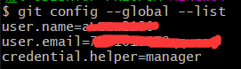
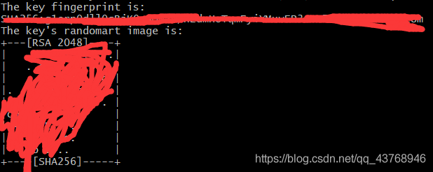
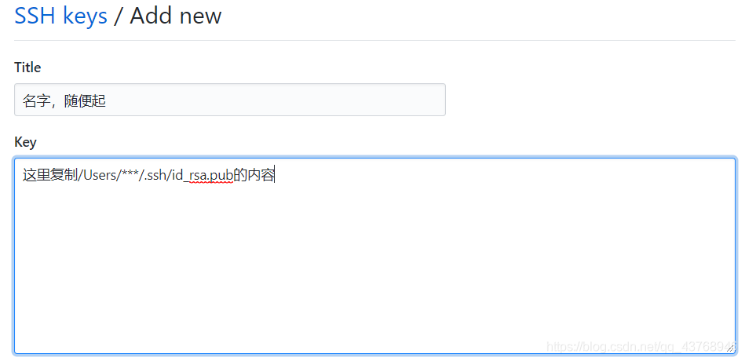

## 解决git@github.com: Permission denied (publickey).错误

进入git bash界面然后：
第一步，git config --global --list 验证邮箱与GitHub注册时输入的是否一致

第二步，通过git config --global [user.name](http://user.name/) “yourname”，git config --global user.email “email@email.com ”（这里得名字和邮箱都是注册github时用的)设置全局用户名和邮箱。

第三步，ssh-keygen -t rsa -C “这里换上你的邮箱”，一路回车，在出现选择时输入Y，再一路回车直到生成密钥。会在/Users/***/路径下生成一个.ssh文件夹，密钥就存储在其中。

第四步，到git仓库，添加秘钥，

点击Add SSH key

第五部，ssh -T [git@github.com](mailto:git@github.com) 测试一下通不通，通了显示如下

即可正常使用。
不通就是
ssh-agent -s
ssh-add ~/.ssh/id_rsa 操作这两步。